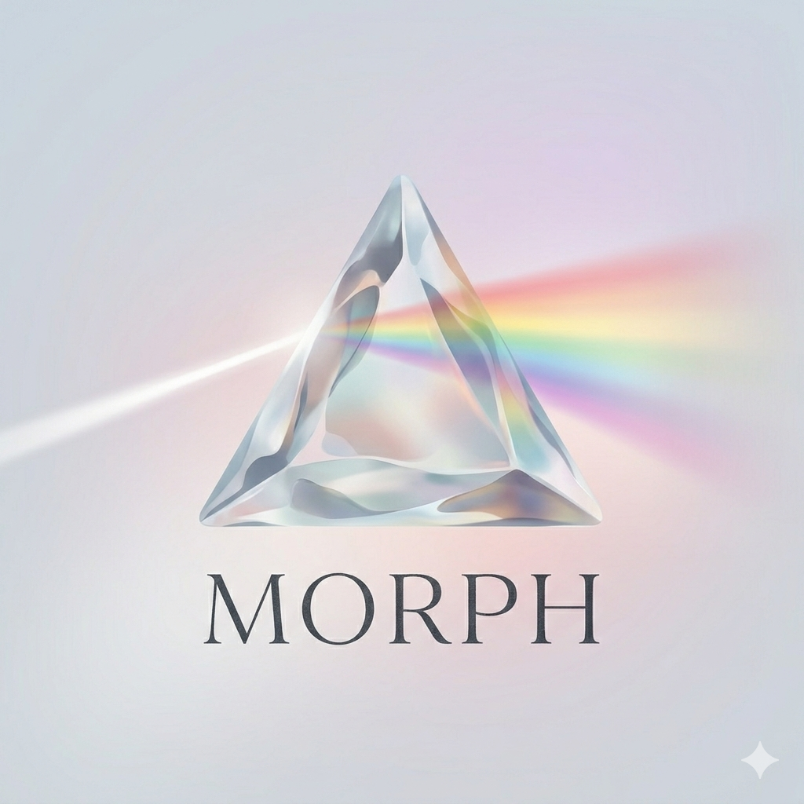

<p align="center">
  
</p>

<h1 align="center">Morph</h1>

<p align="center">Algebraic code generation from domain schemas.</p>

Software contains enormous amounts of mechanical duplication — types echoed across layers, routes that mirror operations, CLI commands that mirror routes, client methods that mirror endpoints. Morph treats this as a factorization problem. A `.morph` schema defines an algebraic theory; each generated package is a structure-preserving functor from that theory. If the core is correct, derived apps are correct by construction.

In practice: write a schema once, generate branded types, Effect-based operations, a REST API, CLI, MCP server, VS Code extension, web UI, HTTP client, protocol buffers, property-based tests, and SMT-LIB2 formal verification. You implement only the business logic handlers.

Morph is deterministic — no LLMs in the generation pipeline. Every transformation is mechanical and structure-preserving, not probabilistic. This confines LLM hallucination risk to the parts that actually need human (or artificial) judgment: business logic handlers and scenario tests. Morph is also therefore fast, computationally efficient, and reliable.

## Example

A `.morph` file defines your domain. Here's a pastebin — a service for sharing text snippets. Users can create, retrieve, list, and delete pastes, and events are emitted for auditing:

```morph
domain Pastebin

extensions {
	storage [memory, jsonfile, sqlite, redis] default memory
	auth [none, inmemory, test] default none
}

context pastes "Simple pastebin for sharing text snippets." {

	@root
	entity Paste "A text snippet shared via URL." {
		content: string "The paste content"
		createdAt: string "When the paste was created (ISO date)"
		title: string "Optional title for the paste"
	}

	@cli @api @ui
	command createPaste "Create a new paste."
		writes Paste
		input {
			content: string "The paste content"
			title?: string "Optional title"
		}
		output Paste
		emits PasteCreated "Emitted when a new paste is created"

	@cli @api @ui
	command deletePaste "Delete a paste."
		writes Paste
		input {
			pasteId: Paste.id "The paste to delete"
		}
		output boolean
		emits PasteDeleted "Emitted when a paste is deleted"
		errors {
			PasteNotFound "The specified paste does not exist" when "pasteId is invalid"
		}

	@cli @api @ui
	query getPaste "Get a paste by ID."
		reads Paste
		input {
			pasteId: Paste.id "The paste to retrieve"
		}
		output Paste
		errors {
			PasteNotFound "The specified paste does not exist" when "pasteId is invalid"
		}

	@cli @api @ui
	query listPastes "List all pastes."
		reads Paste
		input {}
		output Paste[]

	subscriber logPasteEvents "Log paste events for auditing"
		on PasteCreated, PasteDeleted
}
```

Key constructs:

- **`domain`** — names the project, used for package scoping
- **`extensions`** — declares infrastructure backends with selectable options
- **`context`** — groups related entities and operations (bounded context)
- **`@root entity`** — the aggregate root, gets a branded ID type and repository
- **`@cli @api @ui`** — tags control which apps expose each operation
- **`command`** / **`query`** — commands mutate state and emit events; queries are read-only

From this, Morph generates:

| Package                                                            | What it produces                                                  |
| ------------------------------------------------------------------ | ----------------------------------------------------------------- |
| [dsl](contexts/generation/targets/dsl/README.md)                   | Branded IDs, Effect schemas, operation descriptors                |
| [core](contexts/generation/targets/core/README.md)                 | Handler interfaces, repository ports, dependency injection layers |
| [api](contexts/generation/targets/api/README.md)                   | REST routes, OpenAPI spec, SSE event streams, auth middleware     |
| [cli](contexts/generation/targets/cli/README.md)                   | Interactive REPL and one-off commands                             |
| [mcp](contexts/generation/targets/mcp/README.md)                   | MCP server exposing operations as LLM tools                       |
| [ui](contexts/generation/targets/ui/README.md)                     | Server-rendered web UI (Pico CSS)                                 |
| [vscode](contexts/generation/targets/vscode/README.md)             | VS Code extension with DSL language support                       |
| [client](contexts/generation/targets/client/README.md)             | Type-safe HTTP client library                                     |
| [cli-client](contexts/generation/targets/cli-client/README.md)     | CLI that calls the API instead of running locally                 |
| [proto](contexts/generation/targets/proto/README.md)               | Protocol buffer definitions                                       |
| [verification](contexts/generation/targets/verification/README.md) | SMT-LIB2 formal verification of invariants (Z3)                   |
| [monorepo](contexts/generation/targets/monorepo/README.md)         | Root configs, Procfile, workspace setup                           |
| [impls](contexts/generation/targets/impls/README.md)               | Handler scaffolds — the only generated files you edit             |

### What you write

Everything above is generated. You provide:

- **Domain schema** (`.morph`) — the model definition
- **Handler implementations** (`impls/*.ts`) — pure business logic for each operation
- **Subscriber implementations** (`subscribers/*.ts`) — side-effect handlers for domain events
- **Scenario tests** (`scenarios/scenarios.ts`) — given/when/then behavior specs
- **Prose templates** (`dsl/prose.ts`) — human-readable operation descriptions
- **Text catalog** (`text.config.ts`) — localized UI strings and labels (optional)
- **UI theme** (`ui.config.ts`) — visual customization (optional)

These hand-written parts are well-suited to LLM assistance — the schema constrains every interface, so an LLM filling in a handler has a typed contract to satisfy rather than open-ended generation.

## How it works

Morph is built on [Lawvere's functorial semantics](https://en.wikipedia.org/wiki/Lawvere_theory). A `.morph` schema defines a theory T (sorts = types, operations = morphisms, invariants = equations). Each generator is a functor T → **Eff** that preserves structure.

| Algebraic concept       | In Morph               | What gets generated                                                          |
| ----------------------- | ---------------------- | ---------------------------------------------------------------------------- |
| Theory T                | `.morph` schema        | DomainSchema (canonical JSON)                                                |
| Free algebra            | DSL package            | Types, schemas, operation descriptors — pure data, no implementation choices |
| Concrete algebra        | Core package           | Handlers, services, repositories — where business logic lives                |
| Natural transformations | App packages           | API routes, CLI commands, MCP tools — structural adapters                    |
| Equations               | Invariants + scenarios | Property tests, formal verification, BDD scenarios                           |

Scenarios run against multiple targets (@core, @api, @cli). If core passes but API fails, the natural transformation has a bug — the diagram doesn't commute. See the [testing architecture](contexts/generation/testing/README.md) for details.

Morph generates its own CLI, MCP server, and VS Code extension from [`schema.morph`](schema.morph). See [Algebraic Foundations](docs/concepts/algebraic-foundations.md) for the full treatment.

## Examples

10 example projects from minimal to full-featured, each in `examples/fixtures/<name>/schema.morph`:

| Example            | What it demonstrates                                            |
| ------------------ | --------------------------------------------------------------- |
| `pastebin`         | Minimal — single entity, no auth                                |
| `cache-port`       | Abstract ports, property-based contracts                        |
| `type-gallery`     | Generics, unions, aliases, pure functions                       |
| `address-book`     | Value objects, `@sensitive` fields                              |
| `code-generator`   | Transformation domain — no CRUD, pure functions                 |
| `marketplace`      | Multiple contexts, cross-context references, profiles           |
| `delivery-tracker` | Entity relationships, post conditions                           |
| `blog`             | Role-based auth, domain events, subscribers                     |
| `ledger`           | Event-sourced storage, event store queries                      |
| `todo`             | Full-featured — auth, invariants, events, i18n, all app targets |

Regenerate all examples: `bun run generate:examples`

## Extensions

Extensions are declared in the schema and selected at runtime via environment variables.

- **Storage**: memory, jsonfile, sqlite, redis, event-sourced
- **Auth**: none, JWT, session, API key, password
- **Events**: memory, jsonfile, redis
- **i18n**: configurable language list with base language

See [Extensions](docs/architecture/extensions.md) for details.

## Project structure

```
morph/
  contexts/
    generation/        # Code generators, plugins, builders
      targets/         # 13 generation targets (api, cli, core, dsl, ...)
      builders/        # Shared scaffolding (package.json, Dockerfile, ...)
      generators/      # Cross-cutting generators (types, schemas, routes, ...)
    schema-dsl/        # .morph parser, compiler, decompiler
  extensions/          # Pluggable backends (auth, storage, events)
  examples/
    fixtures/          # Source schemas + hand-written handler impls
  apps/                # Morph's own CLI, MCP server, VS Code extension
  docs/                # Documentation
  scripts/             # Build and generation scripts
```

## Install

Prerequisites: [Bun](https://bun.com/install). Optional: [Z3](https://github.com/Z3Prover/z3) (only needed for the formal verification target).

**Generate a project from a schema:**

```sh
bunx @morphdsl/cli generation:new-project pastebin --schema-file pastebin.morph
cd pastebin && bun install
bun run --filter '@pastebin/api' start   # http://localhost:3000
```

**Install the CLI globally:**

```sh
bun add -g @morphdsl/cli
morph generation:new-project ...
```

**MCP server** (drop into Claude Code, Cursor, etc.):

```jsonc
// .mcp.json
{ "servers": { "morph": { "command": "bunx", "args": ["@morphdsl/mcp"] } } }
```

**VS Code extension:** [`morphdsl.morph-dsl-vscode`](https://marketplace.visualstudio.com/items?itemName=morphdsl.morph-dsl-vscode) — syntax highlighting and language services for `.morph` files.

**Try without installing:** the [playground](https://willclark.tech/morph/playground) runs the parser and generator entirely in the browser.

See [Getting Started](docs/guides/getting-started.md) for the full walkthrough.

## Status

What works: DSL parser with error recovery, all 13 generation targets, 10 example apps, 5 storage backends, auth providers, property-based testing, formal verification via Z3.

What's next: see [TODO.md](TODO.md).

No backward compatibility guarantees. Breaking changes happen freely.

## Documentation

### Getting Started
- **[Getting Started](docs/guides/getting-started.md)** — Write a schema, generate a project, run it
- **[DSL Reference](docs/guides/dsl-reference.md)** — Full `.morph` syntax

### Concepts
- **[Algebraic Foundations](docs/concepts/algebraic-foundations.md)** — Functorial semantics model
- **[CQRS](docs/concepts/cqrs.md)** — Command/query separation
- **[Domain Events](docs/concepts/domain-events.md)** — Event sourcing and subscribers
- **[Extensions](docs/architecture/extensions.md)** — Storage, auth, codec, events
- **[Transformation Domains](docs/concepts/transformation-domains.md)** — Non-CRUD pure-function schemas
- **[Modeling by Example](docs/concepts/modeling-by-example.md)** — Example-driven schema design
- **[Features and Bugs](docs/concepts/features-and-bugs.md)** — Defining correctness

### Architecture
- **[Source Tour](docs/architecture/tour.md)** — Guided walkthrough of key source files
- **[Contexts Structure](docs/architecture/contexts-structure.md)** — Context-centric package organization
- **[Domain Model](docs/domain-model.md)** — Visual documentation from schema
- **[12-Factor Conformance](docs/architecture/12-factor.md)** — Generated apps follow 12-factor

### Design
- **[Authorization](docs/design/authorization.md)** — Auth as domain invariants
- **[Execution Context](docs/design/context.md)** — How context flows
- **[Schema Model](docs/design/schema-model.md)** — Schema model design
- **[UI Authentication](docs/design/ui-auth.md)** — Auth in generated web UIs
- **[Prose Design](docs/design/prose-design.md)** — Human-readable BDD templates

### Testing & Verification
- **[Testing Philosophy](docs/concepts/testing-philosophy.md)** — Scenarios as algebraic laws
- **[Formal Verification](docs/concepts/formal-verification.md)** — SMT-LIB2 invariant verification

## Developing Morph

To work on Morph itself (rather than using it to generate apps), see [CONTRIBUTING.md](CONTRIBUTING.md). Quick path:

```sh
git clone https://github.com/willclarktech/morph
cd morph
bun install
bun run generate:examples   # produces examples/{pastebin,todo,…}
bun run test
```

Useful commands:

```sh
bun run build:check       # Type check all packages
bun run lint:fix          # Fix lint issues
bun run format:fix        # Fix formatting
bun run regenerate:morph  # Regenerate Morph from schema.morph
```

Generated code (`examples/`, `apps/`, `contexts/generation/*/` except `impls/`) should never be edited directly — fix the generator instead.
