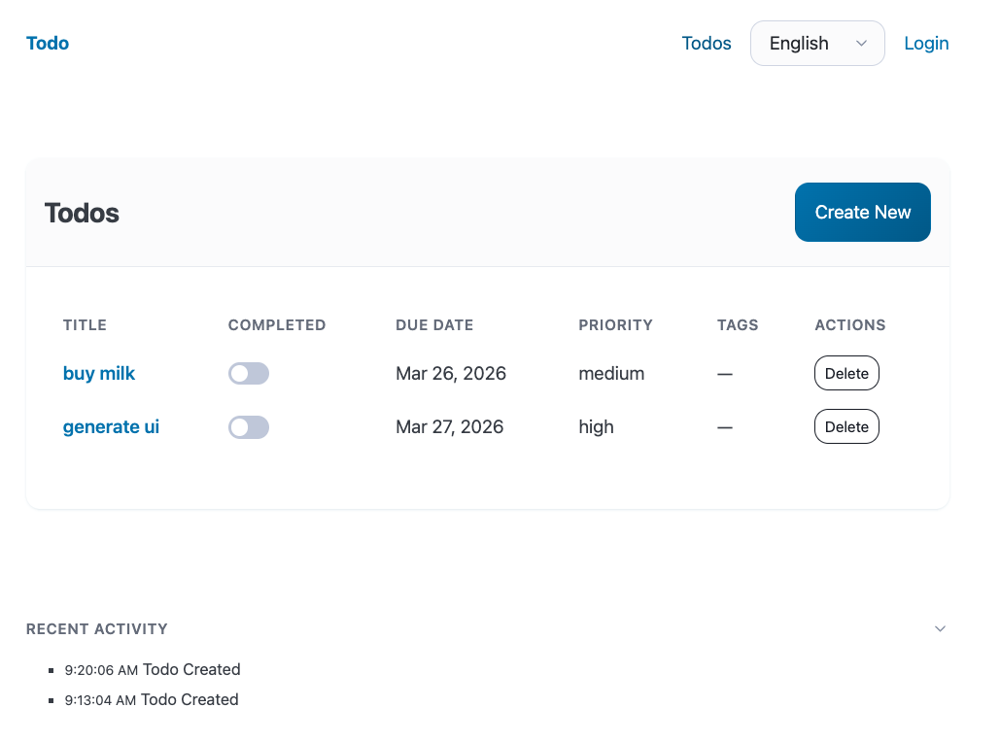
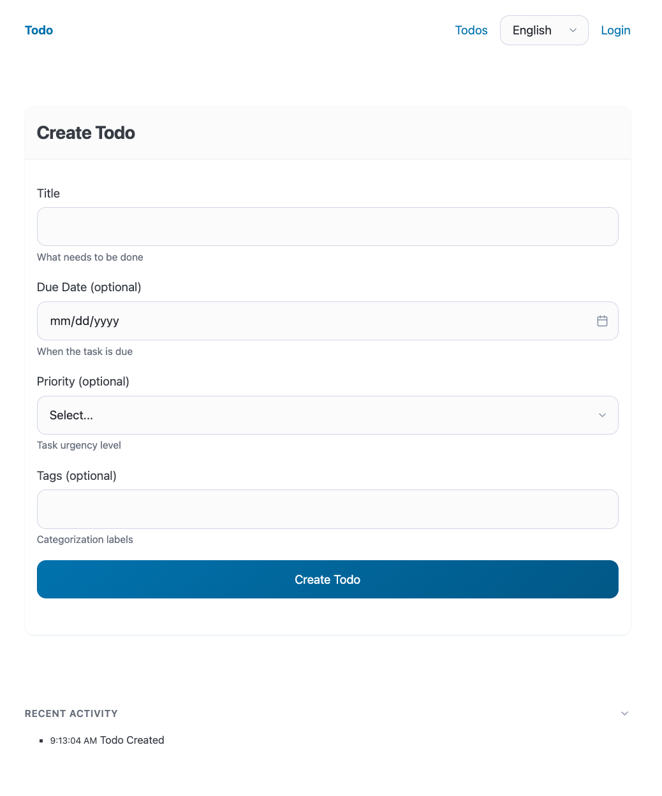

# UI

Generates a server-rendered web application using HTMX + Pico CSS. The UI server communicates with the API via the typed HTTP client and manages sessions with HttpOnly cookies.

## What It Generates

| File | Purpose |
|------|---------|
| `src/index.ts` | `Bun.serve()` entry point with route handlers |
| `src/pages.ts` | HTML page generators for each entity (list, create, view) |
| `src/layout.ts` | Shared HTML layout with navigation |
| `src/nav.ts` | Navigation component |
| `src/formatters.ts` | Display formatting helpers |
| `src/session.ts` | In-memory session store with cookie management |
| `src/text.ts` | i18n translations |
| `src/text-types.ts` | Translation key types (when i18n configured) |
| `src/settings.ts` | User settings (language preference) |
| `.env.example` | Environment variable documentation |
| `Dockerfile` | Production container image (port 4000) |
| `src/test/scenarios.test.ts` | Scenario tests with Playwright |

## Schema Triggers

- **Tag:** `@ui` — operations tagged `@ui` become pages/routes
- **Auth:** when `extensions.auth` is configured, generates login/register pages and session management
- **Events:** when commands emit events, can wire SSE for real-time updates
- **i18n:** when `extensions.i18n` is configured, generates multi-language text module
- **Depends on:** `lib-client` and `app-api` (the UI proxies to the API)

## Example

### Generated Output

**src/index.ts** (excerpt):

```typescript
import { createClient } from "@todo/client";
import { createInMemorySessionStore } from "./session";
import { loginPage, listTodoPage, createTodoPage, viewTodoPage } from "./pages";

const sessionStore = createInMemorySessionStore();

const setSessionCookie = (sessionId: string): string =>
  `session_id=${sessionId}; HttpOnly; SameSite=Strict; Path=/; Max-Age=86400`;

const createClientForRequest = (request: Request) => {
  const { token } = getAuthState(request);
  return createClient({
    baseUrl: process.env["TODO_API_URL"] ?? "http://localhost:3000",
    token: token ?? undefined,
  });
};

// Routes render HTML with HTMX for interactivity
// Pages: login, register, home, listTodos, createTodo, viewTodo
```

### Running It

```bash
$ bun run --filter @todo/ui start
# Listening on http://localhost:4000
```

### Screenshots

**Todo list** — table with completion toggles, priority, tags, and delete buttons:



**Create form** — typed fields derived from schema attributes:



### Pages

| Route | Page |
|-------|------|
| `/login` | Email/password login form |
| `/register` | User registration form |
| `/` | Home / dashboard |
| `/todos` | Todo list with filters |
| `/todos/new` | Create todo form |
| `/todos/:id` | Todo detail view |

## Testing

The UI target has a scenario runner that uses the HTTP client to test server-rendered responses. See the [testing README](../../testing/README.md).
