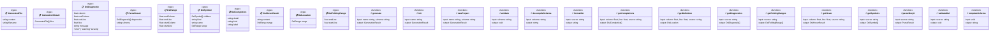

# Domain Model

> Visual documentation generated from schema.

## Types & Functions

```mermaid
classDiagram

    %% Types
    class `📋 GeneratedFile` {
        <<type>>
        string content
        string filename
    }
    class `📋 GenerationResult` {
        <<type>>
        GeneratedFile[] files
    }
    class `📋 DslDiagnostic` {
        <<type>>
        float column
        float endColumn
        float endLine
        float line
        string message
        "error" | "warning" severity
    }
    class `📋 ParseResult` {
        <<type>>
        DslDiagnostic[] diagnostics
        string schema
    }
    class `📋 DslRange` {
        <<type>>
        float endColumn
        float endLine
        float startColumn
        float startLine
    }
    class `📋 DslSymbol` {
        <<type>>
        DslSymbol[] children
        string kind
        string name
        DslRange range
    }
    class `📋 DslCompletion` {
        <<type>>
        string detail
        string kind
        string label
    }
    class `📋 DslHoverResult` {
        <<type>>
        string content
        DslRange range
    }
    class `📋 DslLocation` {
        <<type>>
        DslRange range
    }
    class `📋 DslFoldingRange` {
        <<type>>
        float endLine
        float startLine
    }

    %% Functions
    class `⚡ generate` {
        <<function>>
        input: name: string, schema: string
        output: GenerationResult
    }
    class `⚡ init` {
        <<function>>
        input: name: string
        output: GenerationResult
    }
    class `⚡ newProject` {
        <<function>>
        input: name: string, schema: string
        output: GenerationResult
    }
    class `⚡ validate` {
        <<function>>
        input: schema: string
        output: void
    }
    class `⚡ decompileSchema` {
        <<function>>
        input: schema: string
        output: string
    }
    class `⚡ formatDsl` {
        <<function>>
        input: source: string
        output: string
    }
    class `⚡ getCompletions` {
        <<function>>
        input: column: float, line: float, source: string
        output: DslCompletion[]
    }
    class `⚡ getDefinition` {
        <<function>>
        input: column: float, line: float, source: string
        output: DslLocation
    }
    class `⚡ getDiagnostics` {
        <<function>>
        input: source: string
        output: DslDiagnostic[]
    }
    class `⚡ getFoldingRanges` {
        <<function>>
        input: source: string
        output: DslFoldingRange[]
    }
    class `⚡ getHover` {
        <<function>>
        input: column: float, line: float, source: string
        output: DslHoverResult
    }
    class `⚡ getSymbols` {
        <<function>>
        input: source: string
        output: DslSymbol[]
    }
    class `⚡ parseMorph` {
        <<function>>
        input: source: string
        output: ParseResult
    }
    class `⚡ validateDsl` {
        <<function>>
        input: source: string
        output: void
    }
    class `⚡ templateSchema` {
        <<function>>
        input: void
        output: string
    }
```
