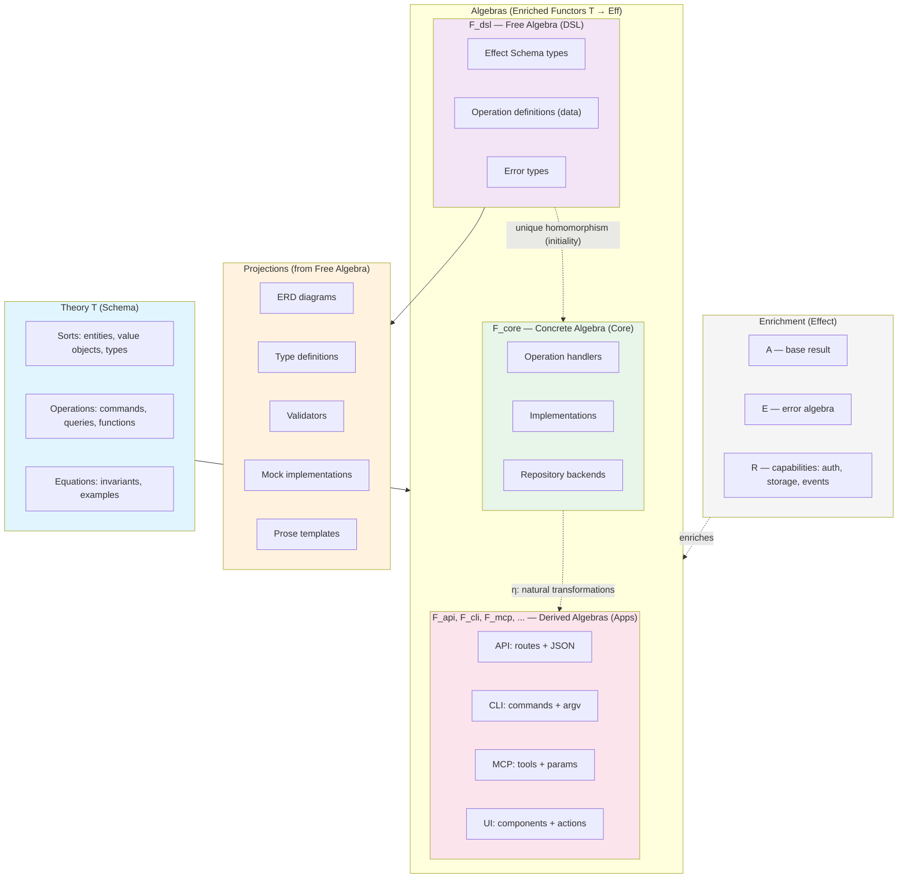

# Algebraic Foundations

Morph is built on [Lawvere's functorial semantics](https://en.wikipedia.org/wiki/Lawvere_theory): a domain schema defines an algebraic theory, and each generated package is a functor from that theory into a target category of programs. App adapters are natural transformations between these functors.

## Conceptual Overview



## Theory T: The Schema as a Category

A domain schema defines a **multi-sorted algebraic theory** — a small category T where:

- **Objects** are sorts: entities, value objects, type aliases
- **Morphisms** are operations: typed arrows from input to output
- **Equations** are invariants: commuting conditions that valid interpretations must satisfy

| Schema Element               | Role in T                                                             |
| ---------------------------- | --------------------------------------------------------------------- |
| `entities`                   | Sorts (carrier sets with identity)                                    |
| `valueObjects`               | Product types (carrier sets without identity)                         |
| `types`, `aliases`, `unions` | Type constructors (products, coproducts, aliases)                     |
| `commands`                   | Morphisms with effects (state mutation, event emission)               |
| `queries`                    | Morphisms without effects (observations)                              |
| `functions`                  | Pure morphisms (no state, no effects)                                 |
| `invariants`                 | Equations: conditions that must hold across all valid interpretations |
| `errors`                     | Partiality: operations are partial morphisms with typed failure cases |

The key distinction: commands mutate state (they change the carrier set's elements), queries observe state (read-only morphisms), and functions are pure (no state at all — genuine morphisms in the mathematical sense).

## Algebras as Enriched Functors

In Lawvere's framework, an **algebra** (or **model**) of a theory T is a structure-preserving functor from T into some target category. It maps each sort to a concrete type and each operation to a concrete program.

Morph's algebras are **enriched functors** F: T → **Eff**, where **Eff** is the category of Effect computations. The enrichment matters: Effect's type signature `Effect<A, E, R>` encodes three layers of structure.

| Parameter | What it encodes | Categorical role                                                |
| --------- | --------------- | --------------------------------------------------------------- |
| `A`       | Result value    | Base algebra: sorts → types, operations → programs              |
| `E`       | Error types     | Partiality: operations are partial morphisms with typed failure |
| `R`       | Requirements    | Capability grading: which services the operation needs          |

Each algebra maps theory T into Eff differently:

| Algebra | Functor | What it maps sorts to  | What it maps operations to        |
| ------- | ------- | ---------------------- | --------------------------------- |
| DSL     | F_dsl   | Effect Schema types    | OperationCall descriptions (data) |
| Core    | F_core  | Concrete types         | Effect programs (with handlers)   |
| API     | F_api   | JSON schemas           | HTTP route handlers               |
| CLI     | F_cli   | Display formats        | Shell commands                    |
| MCP     | F_mcp   | Tool parameter schemas | Tool handlers                     |
| Mocks   | F_mock  | Fast-check arbitraries | Mock implementations              |

All these functors target **Eff** — the app-specific categories (HTTP routes, shell commands, tool handlers) are subcategories of Effect computations. An HTTP route handler _is_ an Effect program that additionally processes request/response. A CLI command _is_ an Effect program that additionally parses argv.

## The Free Algebra: DSL as Initial Object

The DSL functor F_dsl is the **initial object** (free algebra) in the category of T-algebras. This means: for any other algebra F, there exists a unique homomorphism from F_dsl to F.

Concretely:

- Operations are represented as data (`OperationCall` descriptions), not executions
- No implementation choices are made — the DSL captures pure structure
- Any other interpretation can be derived from it

Initiality is why **projections** work. Diagrams, validators, mocks, and prose templates are all computable from F_dsl's structure, because the free algebra makes the maximum amount of structural information available.

| Projection            | What it computes from F_dsl                     |
| --------------------- | ----------------------------------------------- |
| ERD diagrams          | Entity relationships from sort references       |
| Type definitions      | TypeScript types from Effect Schema             |
| Validators            | Runtime validation from schema constraints      |
| Repository interfaces | Ports from entity sorts                         |
| Mock implementations  | Fast-check arbitraries from schema structure    |
| Prose templates       | Natural language from operation names and types |

## Concrete Algebras

The core functor F_core is a **non-free algebra** — it makes specific implementation choices beyond what the theory requires:

- Handlers implement _how_ operations execute
- Repository backends choose _where_ data lives
- Business logic satisfies the theory's equations (invariants)

The mock algebra F_mock is another non-free algebra: fast-check arbitraries generate valid instances, and mock handlers produce plausible results. It's useful for property testing — a different interpretation of the same theory.

## Natural Transformations: Apps as Homomorphisms

A **natural transformation** η: F ⇒ G between two algebras (functors) is a family of morphisms, one per object of T, that commutes with the algebra structure. In Lawvere's framework, this is exactly an **algebra homomorphism**.

The app adapters are natural transformations from F_core to derived algebras:

- **η_api: F_core ⇒ F_api** — wraps each core handler as an HTTP route
- **η_cli: F_core ⇒ F_cli** — wraps each core handler as a CLI command
- **η_mcp: F_core ⇒ F_mcp** — wraps each core handler as an MCP tool

For each sort (entity/type) X in T, the component η_X maps F_core(X) to F_api(X) — the core type to its API representation.

**Naturality condition**: for any operation f: X → Y in T:

```
η_Y ∘ F_core(f) = F_api(f) ∘ η_X
```

In words: applying the core operation then adapting the result to HTTP must equal adapting the input to HTTP then applying the API operation. The order doesn't matter — the diagram commutes.

This is what "structure-preserving" means concretely: a schema command becomes a core handler, which becomes a POST endpoint, a CLI command, an MCP tool, and a client method. The algebraic structure is preserved through every transformation because each adapter is a natural transformation, not an ad hoc wrapper.

## The Enrichment: Auth, Events, and Layers

Cross-cutting concerns (auth, storage, events) aren't ad hoc additions — they're part of the enriched functor's structure, encoded in Effect's `R` (requirements) parameter.

### Capabilities as Grading

An operation's `R` type grades it by the capabilities it needs. The generator inspects the theory (schema invariants) and determines the grade:

- An invariant referencing `context.currentUser` adds auth capabilities to R (inferred from invariant expressions)
- Entity persistence adds per-entity repository services to R (e.g., `TodoRepository`, `UserRepository`)
- Event emission adds `EventEmitter` to R

This grading is intrinsic to the enriched functor — it's not a meta-level escape from the algebra, it's part of what the functor maps each operation to.

### Extensions as Sub-theory Algebras

The storage interface (get, put, delete, list) is itself a small algebraic theory. Each backend is a different algebra of that sub-theory:

| Sub-theory  | Algebras (backends)                   |
| ----------- | ------------------------------------- |
| Storage     | Memory, JSONFile, SQLite, Redis       |
| Auth        | Password, JWT, API key, Session, None |
| Event store | Memory, JSONFile, Redis               |

Choosing a backend is choosing an algebra for a sub-theory. The main algebra F*core \_depends on* these sub-theory choices but is parametric over them — any valid storage algebra satisfies the same interface.

### Layers as a Monoidal Category

Effect Layers compose the capability algebras into a complete runtime environment. This composition forms a **symmetric monoidal category**:

- **Objects**: requirement types (the `R` in `Effect<A, E, R>`)
- **Morphisms**: layers (`Layer<ROut, E, RIn>` — "given RIn, provide ROut")
- **Tensor**: `Layer.mergeAll` (provide multiple capabilities: R_1 ⊗ R_2)
- **Unit**: `Layer.empty` (no requirements)

`Effect.provide(layer)` is the **evaluation morphism** — it eliminates requirements by supplying concrete implementations. The full app layer (`AppLayer = AuthLayer | StorageLayer | EventLayer`) is a tensor product in this monoidal category, composing all the sub-theory algebra choices into a single runtime.

## Verifying Algebraic Laws

Morph verifies that algebras satisfy the theory's laws at three levels — scenarios (example-based), property tests (probabilistic), and formal verification (exhaustive). Each level corresponds to a different kind of evidence about the algebraic structure.

### Scenarios Verify Naturality

Gherkin scenarios are **equations in the theory T**. Each scenario asserts: given these preconditions, this operation produces this result.

Running a scenario against interpretation F means applying F to the equation and checking it holds. The step definitions for each target runner (core, api, cli, mcp) are the **components of the natural transformation** — they map abstract scenario steps to concrete actions in each interpretation.

| Component        | Algebraic role                                         |
| ---------------- | ------------------------------------------------------ |
| Scenario         | Equation in T                                          |
| Core step defs   | Components of F_core applied to the equation           |
| API step defs    | Components of η_api ∘ F_core applied to the equation   |
| CLI step defs    | Components of η_cli ∘ F_core applied to the equation   |
| All runners pass | Evidence that η preserves equations (naturality holds) |

If the same scenario passes for F_core and F_api, this provides evidence that η_api is a valid natural transformation — it preserves the algebraic laws. If core passes but API fails, the API generator has a bug: the natural transformation doesn't commute for that equation.

### Property Tests Verify Invariants Probabilistically

Property-based tests (fast-check) verify that the algebra's **universal laws** — invariants that must hold for all inputs — are satisfied by randomly sampling the input space. The same `ConditionExpr` AST that defines invariants in the schema is compiled to JavaScript predicates and tested against schema-derived arbitraries.

| Suite type | What it verifies                                                      |
| ---------- | --------------------------------------------------------------------- |
| Validator  | Guard functions correctly implement invariant predicates              |
| Operation  | Operation execution respects pre/post invariants across random inputs |
| Contract   | Port implementations (storage, auth, events) satisfy algebraic laws   |

Contract suites are particularly relevant: they verify that **sub-theory algebras** (storage backends, auth backends) satisfy the same interface laws regardless of implementation. PutGetRoundtrip, RemoveIdempotent, and similar laws hold for memory, JSON file, SQLite, and Redis backends alike — evidence that backend choice doesn't break the algebra.

### Formal Verification Proves Invariants Exhaustively

The `verification` target generates SMT-LIB2 checks from the same `ConditionExpr` AST — same source, different compilation backend. Z3 proves properties for **all** inputs, not just sampled ones:

| Check                       | What it proves                                                           |
| --------------------------- | ------------------------------------------------------------------------ |
| Consistency                 | Entity invariants don't contradict each other                            |
| Precondition satisfiability | Each operation's preconditions can actually be satisfied (not dead code) |
| Preservation                | Operations preserve entity invariants: pre ∧ post → invariant            |

The invariant fragment (QF_UFLIA with bounded quantifier macros) is decidable — Z3 terminates with a definitive answer. When verification fails, Z3 produces a concrete counterexample. See [Formal Verification](../testing/formal-verification.md) for the full specification.

## Limitations of the Analogy

Two qualifications:

**Target categories are informal.** "Eff" as a category of Effect computations doesn't have a standard mathematical definition. The objects are TypeScript types, the morphisms are Effect programs, and composition is `Effect.flatMap` / `pipe`. This is workable as a design language — it guides architecture and catches structural errors. The `verification` target partially closes this gap: invariants expressed as `ConditionExpr` are compiled to SMT-LIB2 and checked by Z3, giving formal proofs for the decidable fragment (QF_UFLIA). This covers consistency, satisfiability, and preservation of entity invariants — but not the full behavior of Effect programs, which remains outside formal reach.

**Generator meta-level.** The generators themselves (the build-time code that reads schemas and emits TypeScript) operate at a _meta-level_ above the algebra. The generator is a function from theories to code, not a functor within a single theory. This is analogous to how a compiler is not a program in the language it compiles. The algebraic model describes the _generated_ code and its relationships, not the generation process itself.

## Why This Matters

1. **Single source of truth**: The schema is the theory. Everything else is a functor from it.
2. **Correctness by construction**: Natural transformations preserve algebraic structure — if the core is correct, derived apps are correct.
3. **Separation of concerns**: The free algebra (DSL) separates _what_ from _how_. The enrichment separates _capabilities_ from _implementations_.
4. **Testability**: Scenarios are equations. Running them against multiple interpretations tests naturality.
5. **Extensibility**: New apps are new natural transformations. New backends are new sub-theory algebras. The framework is open at the adapter level while closed at the algebraic level.
